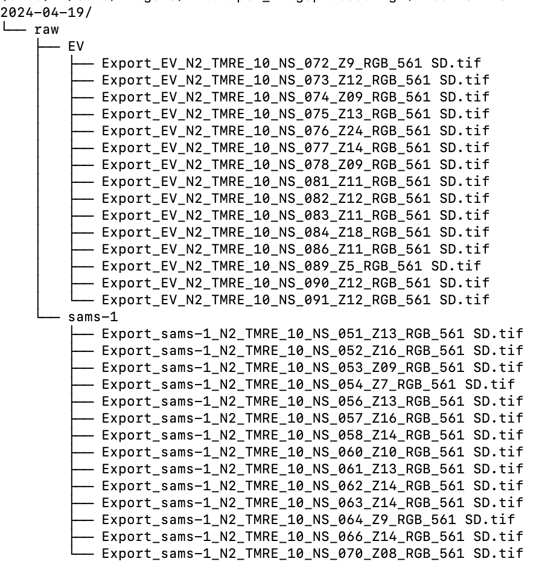

# RotatoROI_II Plugin Setup Instructions

The **RotatoROI_IIPlugin** relies on a specific directory structure in order to find and process files. 
* Before processing (**Process Preparation**)
    * A `[root]` directory for your process must be created. 
        * This is the location where the **RotatoROI_II** processes will search for files and create output.
        * This directory can be anywhere on the hard drive.
        * It's best to use a naming convention that aligns with the overall experiment.
            * For example: `[root]` = `/Users/dan/MitoPaper_imageprocessing/2024-04-19`

* The first pipeline step (**Process .nd2**)
    * **INPUT** 
        * The 'Process .nd2' Expects to find .nd2 files in the `[root]/raw` directory
        * Within this `[root]/raw` directory, you *MUST* create additional `[experimental condition]` directories that will contain the `.nd2` images to be processed.
        * The `[root]/raw/[experimental condition]` directory can have any name but should be related to the experimental condition or subject of your images.
            * For example:
                * `[root]/raw/[experimental condition <EV>]`     = `/Users/dan/MitoPaper_imageprocessing/2024-04-19/raw/EV`
                * `[root]/raw/[experimental condition <sams-1>]` = `/Users/dan/MitoPaper_imageprocessing/2024-04-19/raw/sams-1`
 
        * The .nd2 files *MUST* contain 3 Channels
            * Channel 1 is the DIC
            * Channel 2 is 488
            * Channel 3 is 561
        * 
    * **OUTPUT**
        * The output of the 'Process .nd2' is a new directory `[root]/channel_split`
            * The **channel_split** directory will will contain the subdirectories for each split channel.
                * `[root]/channel_split/488/[experimental condition]]`
                * `[root]/channel_split/561/[experimental condition]]`
                * `[root]/channel_split/DIC/[experimental condition]]`

### Step 3: Place Images in the Proper Directories
Finally, the `.tif` images to be processed should be placed in these directories.

### Example Directory Structure
An image of an example directory structure is provided.

